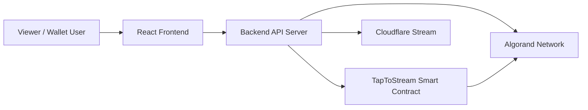
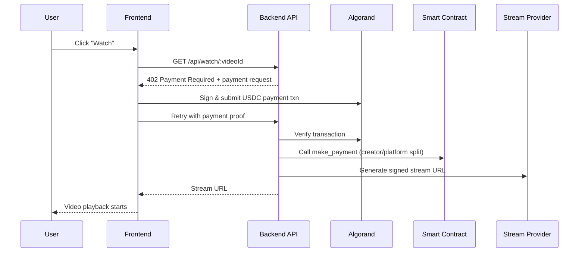

# TapToStream

TapToStream is an Algorand-powered **pay-per-view video streaming platform**.  
Instead of subscriptions, users pay per video in USDC, and payouts are split on-chain between creator and platform.

---

## Problem Statement

Video creators and niche platforms often need flexible monetization without forcing users into monthly subscriptions.  
TapToStream solves this by enabling:

- per-video payments
- blockchain-verifiable payments
- transparent payout distribution

---

## Solution Overview

TapToStream combines:

- a **React frontend** for browsing and watching videos
- an **Express backend** for payment verification and stream access control
- an **Algorand smart contract** to distribute USDC payouts

The viewer only gets the stream URL after payment is validated.

---

## Architecture (Visual Representation)



---

## Payment + Unlock Flow (Visual Representation)



---

## Tech Stack

### Frontend
- React 18 + TypeScript + Vite
- Tailwind CSS
- `hls.js` for HLS playback
- Wallet integration via `@txnlab/use-wallet-react` (Pera, Defly, Exodus)
- `algosdk` and `@algorandfoundation/algokit-utils`

### Backend
- Node.js + Express
- CORS + dotenv + JWT
- `algosdk` for transaction verification and blockchain interaction

### Smart Contracts
- Algorand Python (Puya / AlgoKit smart contract pipeline)
- ARC-56 artifacts for typed client generation

### Tooling
- AlgoKit workspace orchestration
- Poetry (contracts project)
- npm scripts for frontend/backend workflows

---

## Project Structure

```text
taptostream/
├─ server/                         # Express API + payment middleware + stream logic
├─ projects/
│  ├─ taptostream-contracts/       # Algorand smart contracts and deployment scripts
│  └─ taptostream-frontend/        # React frontend application
├─ .algokit.toml                   # Workspace command orchestration
└─ README.md
```

---

## API Endpoints

- `GET /api/health` - health check
- `GET /api/videos` - list available videos and metadata
- `GET /api/watch/:videoId` - protected watch endpoint (payment-gated)

---

## On-Chain and Off-Chain Data Model

### Off-chain
- `server/videos.json` stores:
  - `videoId`
  - `title`
  - `cfUid`
  - `creatorAddress`
  - `priceUSDC`

### On-chain (Contract State)
- global values for:
  - platform wallet
  - USDC asset id
- payment split logic executed in contract method calls

---

## Local Setup

### Prerequisites
- [AlgoKit CLI](https://github.com/algorandfoundation/algokit-cli)
- [Docker](https://www.docker.com/) (for localnet)
- Node.js 18+ and npm
- Python 3.12+ and Poetry

### 1) Bootstrap Workspace

```bash
algokit project bootstrap all
```

### 2) Build Everything

```bash
algokit project run build
```

### 3) Run Backend

```bash
npm run server
```

### 4) Run Frontend

```bash
cd projects/taptostream-frontend
npm run dev
```

---

## Environment Configuration

Use templates as a starting point:

- root backend/contracts config: `.env.example`
- frontend config template: `projects/taptostream-frontend/.env.template`

> Important: Never commit real mnemonics, private keys, or production secrets.

---

## Key Features

- Wallet-based pay-per-view access
- 402-style payment challenge and retry flow
- On-chain payout split (creator + platform)
- Signed URL unlock for streaming
- Modular monorepo architecture for contracts + API + frontend

---

## Related Docs

- Smart contracts: [`projects/taptostream-contracts/README.md`](projects/taptostream-contracts/README.md)
- Frontend app: [`projects/taptostream-frontend/README.md`](projects/taptostream-frontend/README.md)

---

## Roadmap (Suggested)

- add complete backend/contract/frontend test coverage
- move video metadata from JSON to a persistent database
- improve payment replay/idempotency protections
- add CI workflows for build, lint, and tests
