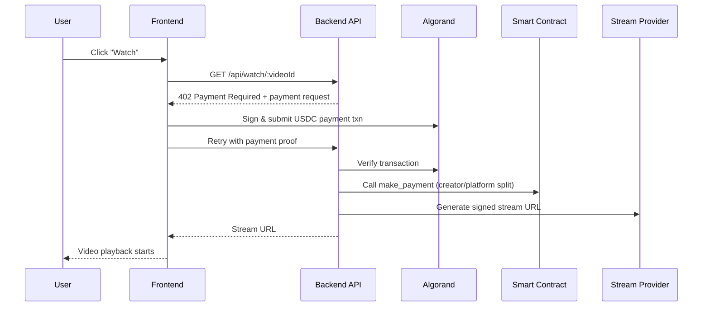
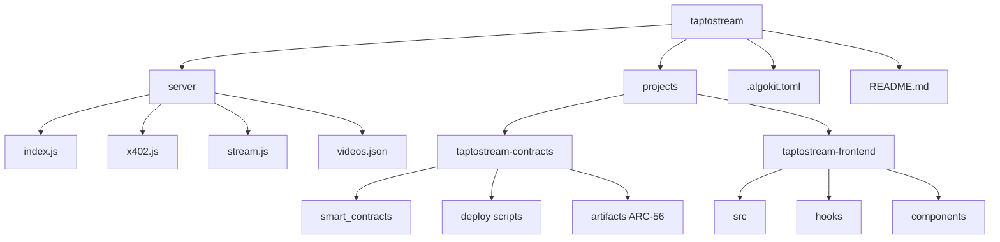

# TapToStream 🎬

TapToStream is an Algorand-powered **pay-per-view video streaming platform**.  
Instead of subscriptions, users pay per video in USDC, and payouts are split on-chain between creator and platform.

---

## Problem Statement

Video creators and niche platforms often need flexible monetization without forcing users into monthly subscriptions.  
TapToStream solves this by enabling:

- per-video payments
- blockchain-verifiable payments
- transparent payout distribution

---

## Solution Overview

TapToStream combines:

- a **React frontend** for browsing and watching videos
- an **Express backend** for payment verification and stream access control
- an **Algorand smart contract** to distribute USDC payouts

The viewer only gets the stream URL after payment is validated.

---

## Architecture (Visual Representation)

---

## Payment + Unlock Flow (Visual Representation)

---

## Tech Stack 🧰

| Layer | Technology | Purpose |
|---|---|---|
| Frontend | React 18 + TypeScript + Vite | UI, routing, wallet-first user experience |
| Styling | Tailwind CSS | Fast and consistent UI styling |
| Video Playback | `hls.js` | HLS streaming support in browser |
| Wallet Integration | `@txnlab/use-wallet-react` | Pera, Defly, Exodus wallet connectivity |
| Backend | Node.js + Express | Payment-gated API and stream unlock orchestration |
| Auth/Signing | `jsonwebtoken` | Signed stream URL / token flow |
| Blockchain SDK | `algosdk` | Txn creation, verification, Algorand interaction |
| Smart Contracts | Algorand Python (Puya) | On-chain payment split logic |
| Contract Artifacts | ARC-56 | Typed client generation and ABI integration |
| Workspace Tooling | AlgoKit | Build/deploy orchestration across projects |
| Python Tooling | Poetry | Contract environment and dependency management |
| JavaScript Tooling | npm scripts | Frontend/backend command workflows |

---

## Project Structure (Architecture View) 🏗

---

## Environment Configuration

Use templates as a starting point:

- root backend/contracts config: `.env.example`
- frontend config template: `projects/taptostream-frontend/.env.template`

> Important: Never commit real mnemonics, private keys, or production secrets.

---

## Key Features

- Wallet-based pay-per-view access
- 402-style payment challenge and retry flow
- On-chain payout split (creator + platform)
- Signed URL unlock for streaming
- Modular monorepo architecture for contracts + API + frontend

---

## 👨‍💻 Author

Made with ❤️ by **Shreyash-devs**  
A passionate developer who enjoys turning ideas into reality using Flutter, Firebase, and a touch of creativity.

- 🔗 [LinkedIn](https://www.linkedin.com/in/shreyashdubewar)  
- 📱 [GitHub](https://github.com/shreyash-devs)  
- ✉️ shreyashdevs.work@gmail.com
